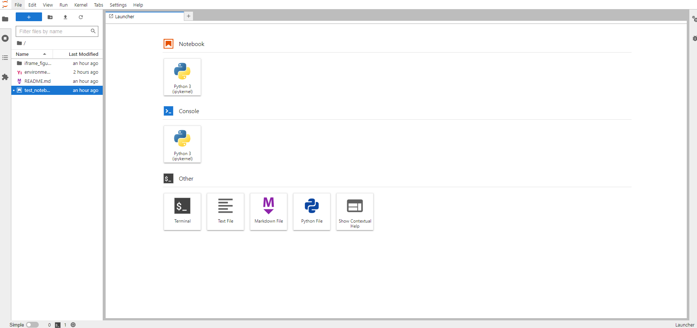

# MyoFE Tutorial Notebooks

This repository is created by Kurtis Mann and maintained by the Computational Biomechanics Lab at the University of Kentucky.  

The goal is for this repository to contain a sequence of notebooks that steps users through FEniCS usage/syntax ultimately up to embedding MyoSim and running ventricle simulations. This set up is avoiding Docker, and will instead use Anaconda to manage our environment. It is recommended that users gain familiarity with command line interfaces, though all executed commands should be in this file. Code snippets in `code blocks` can be copied and pasted into the command prompt, and the user can press Enter to execute. Any user specific information that needs to be replaced in a code block will be surrounded by '`<>`', indicating that the user needs to put in information specifically from their system.
## Setting up your environment
We need the following:
- Anaconda (to manage our environment)
- Python (version 3.10.4)
- dolfin 2019.1.0

### Windows
Unfortunately, FEniCS is not supported for Windows. There is a pretty easy workaround it seems for going through Ubuntu on a Windows machine that will be shown here. The big picture steps we will be taking are:
- [Install and verify installation of wsl on Windows](#install-and-verify-installation-of-wsl-on-Windows)
- [Install Ubuntu using the wsl command prompt](#install-ubuntu-using-the-wsl-command-prompt)
- [Install Anaconda in Ubuntu](#install-anaconda-in-ubuntu)
- [Install Python using Anaconda in Ubuntu](#install-python-using-anaconda-in-ubuntu)
- [Clone this repository](#clone-this-repository)
- [Create and activate the MyoFE environment](#create-and-activate-the-MyoFE-environment)
- [Step through a test Jupyter notebook](#step-through-a-test-jupyter-notebook)

#### Install and verify installation of wsl on Windows
Open the command prompt.  
Execute the command `wsl --install`   
If the wsl help text prints out to the command prompt, it means wsl is already installed.  

#### Install Ubuntu using the wsl command prompt
To install Ubuntu, execute the command `wsl --install -d Ubuntu`  
This will begin to install Ubuntu on your system. Ubuntu is the distribution name, I believe available through the College of Engineering, and should be available to users in the Computational Biomechanics Lab.  
The user will be prompted to create a username and password. Do so.  
The user should now be in a wsl terminal in a Linux environment. The command line commands are different from windows. A cheat sheet can be found [here](https://www.guru99.com/linux-commands-cheat-sheet.html). More information about wsl can be found [here](https://docs.microsoft.com/en-us/windows/wsl/install#install-wsl-command).
#### Install Anaconda in Ubuntu
Anaconda now needs to be installed in Ubuntu. The version of Anaconda depends on your computer architecture (i.e. 32-bit vs. 64-bit). This process was tested on a 64-bit machine, and the name of the Anaconda package installed is Anaconda3-2021.11-Linux-x86_64.sh (the _64 indicates 64 bit, and I chose a recent version from 2021. A full list of available downloads can be found [here](https://repo.anaconda.com/archive/).  
To download, from the Ubuntu terminal execute `wget https://repo.continuum.io/archive/<anaconda_package_name>`  
For example, to downlaod the above mentioned version of Anaconda, one would execute `wget https://repo.continuum.io/archive/Anaconda3-2021.11-Linux-x86_64.sh`  
To then install Anaconda, execute `bash <anaconda_package_name>` from the Ubuntu terminal.
Again as an example using the Anaconda package name above, `bash Anaconda3-2021.11-Linux-x86_64.sh`  
#### Install Python using Anaconda in Ubuntu
Now that Anaconda is installed, we can use it to install Python. For the installation changes to take effect, the Ubuntu terminal needs to be exited and restarted. The Ubuntu program should now be available as an app.  
Once the Ubuntu terminal has been restarted, execute `conda install -c conda-forge python`  
Once this is complete, execute `which python` in the terminal to check that python is installed. There should be 'Anaconda' somewhere in the printed out path. At this point, we can successfully run python code within Ubuntu. Now we need to set up the environment for FEniCS.
#### Clone this repository
In the Ubuntu terminal, navigate to the directory you want to house this repository. Then execute `git clone https://github.com/CharlesMann/myofe_training_notebooks.git` to clone this repository that contains the environment file.
#### Create and activate the MyoFE environment
In the highest directory level of this repository, you will find a file named `environment.yml`. To create the MyoFE environment, navigate to this repository in the Ubuntu terminal and execute `conda env create -f environment.yml`. Note, this step will take some time. Upon completion, activate this environment by executing `conda activate myofe`. Now, all required python packages for MyoFE (at least FEniCS at this point, may have to add some to run the full MyoFE code) are available. Jupyter-Lab is also available.
#### Step through a test Jupyter notebook
To check that the environment is properly created, and to introduce Jupyter notebooks, we can start Jupyter-Lab. From the Ubuntu terminal, execute the command `jupyter-lab`. This will print out a bunch of output, ending with instructions to access Jupyter-Lab. These will include something like  
```
To access the server, open this file in a browser:
       file:///home/ckma224/.local/share/jupyter/runtime/jpserver-8069-open.html
   Or copy and paste one of these URLs:
       http://localhost:8888/lab?token=997c7822b069c66389a906b94d02b18f883094d6d1ea39bf
    or http://127.0.0.1:8888/lab?token=997c7822b069c66389a906b94d02b18f883094d6d1ea39bf
```
Copy the first URL given into your web browser of choice. This will a page that looks like 
Double click on `test_notebook.ipynb` on the left, and follow the instructions of the notebook. When finished, Close the browser window, and in the wsl terminal execute: ctrl + C  
This gives the option to kill the jupyter-lab process. This will be how we access the training notebooks in this repository.

### Mac/Linux
